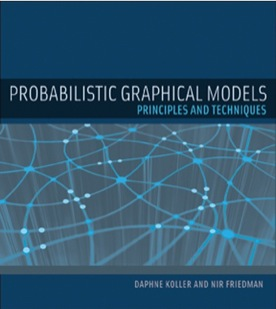

It is difficult to model probability. Consider medical diagnosis. There are thousands of symptoms with millions of possible causes; any of these possible causes or combination of causes can be the source of the patient's symptoms. In situations where there are many uncertain factors interacting with each other, graphical models help break down the representational mess of stochastic systems. Daphne Koller and Nir Friedman provide a powerful, formal framework for representating, inferring, and learning probabilistic graphical models through proofs, helpful intuitions, and plenty of examples and exercises for practice.

<table class="image">
<caption align="bottom"><a href="https://www.amazon.com/Probabilistic-Graphical-Models-Principles-Computation/dp/0262013193/ref=sr_1_1?ie=UTF8&qid=1511220417&sr=8-1&keywords=probabilistic+graphical+models">Probabilistic Graphical Models</a></caption>
<tr><td></td></tr>
</table>

I personally recommend this book for anyone with interest in machine learning. The book makes you think critically about the capacity and expressive power of different variants of graphical models. It is an introductory graduate level textbook (I can only do around half the problems myself) and is a bit tedious with its insistance on proving the soundness and completeness of all properties. These notes are meant primarily for myself, but I thought it might help for anyone who is considering buying the book themselves or just want to taste test PGMs. Enjoy!  

Included:
  1. Foundations
  2. Bayesian Networks
  3. Markov Networks
<object data="../images/pgm_notes.pdf" type="application/pdf" width="700px" height="700px">
    <embed src="../images/pgm_notes.pdf">
        This browser does not support PDFs. Please download the PDF to view it: <a href="../images/pgm_notes.pdf">Download PDF</a>.

    </embed>
</object>
